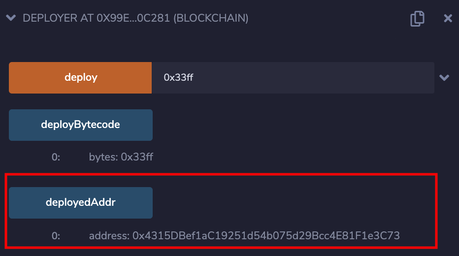
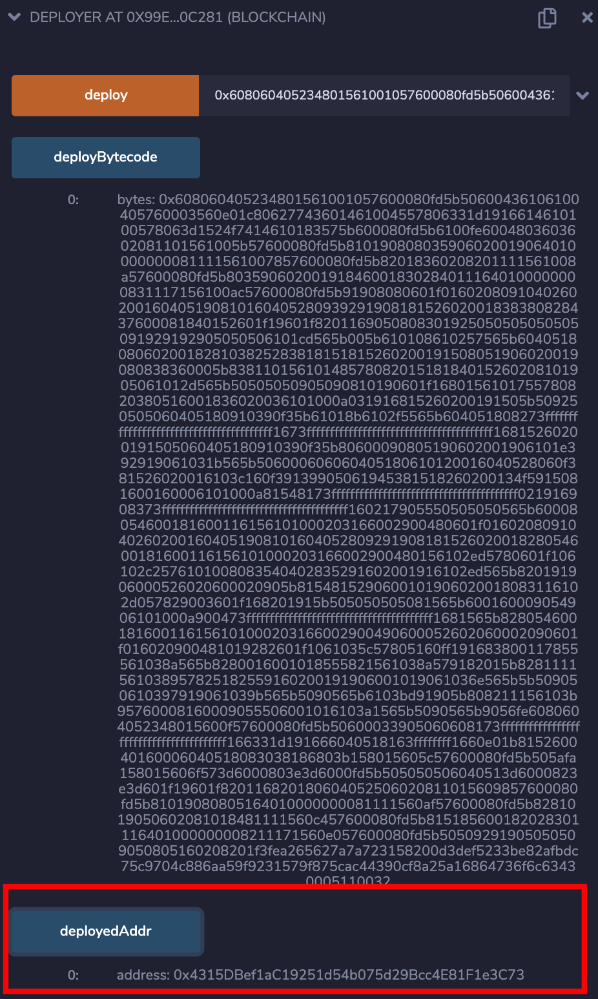

# CREATE2

`CREATE2` 是以太坊在“君士坦丁堡”这次硬分叉升级中引入的一个新操作码，不同于 `CREATE`，它使用新的方式来计算合约地址，让生成的合约地址更具有可控性。通过 `CREATE2` 可以延伸出很多有意思的玩法，在 CTF 中最常见的就是利用这种可控性，在同一个地址先后部署字节码完全不同的合约。

## 原理

### CREATE

如果利用外部账户或者使用 `CREATE` 操作码的合约账户创建一个合约，那么很容易就能确定被创建合约的地址。每个账户都有一个与之关联的 `nonce`：对外部账户而言，每发送一个交易，`nonce` 就会随之 `+1`；对合约账户而言，每创建一个合约，`nonce` 就会随之 `+1`。新合约的地址由创建合约交易的发送者账户地址及其 `nonce` 值计算得到，其具体公式如下：

```python
keccak256(rlp.encode(address, nonce))[12:]
```

### CREATE2

不同于原来的 `CREATE` 操作码，在合约地址的计算方法上，`CREATE2` 不再依赖于账户的 `nonce`，而是对以下参数进行哈希计算，得出新的地址：

- 合约创建者的地址（`address`)
- 作为参数的混淆值（`salt`）
- 合约创建代码    (`init_code`)

具体的计算公式如下：

```python
keccak256(0xff ++ address ++ salt ++ keccak256(init_code))[12:]
```

一个需要注意的重要细节是，计算合约地址所需的最后一个参数并非合约代码，而是其创建代码。该代码是用来创建合约的，合约创建完成后将返回运行时字节码。

这意味着，如果我们控制了合约的创建代码并使其保持不变，然后控制合约构造函数返回的运行时字节码，那么我们很容易就能做到在同一个地址上，反复部署完全不同的合约。事实上 `CREATE2` 这种让合约在部署后可以被重新更改的特性存在着潜在的安全问题，也引起了人们对其的[讨论](https://ethereum-magicians.org/t/potential-security-implications-of-create2-eip-1014/2614)。

在 CTF 中，这种特性往往会被用来作为一个技巧，通过在同一个地址上部署不同的合约用来 bypass 不同的校验。

## 例子

以 2019 Balsn CTF 的 Creativity 的 WP 提供的 PoC 作为例子，讲解一下 `CREATE2` 的巧妙使用：

```solidity
pragma solidity ^0.5.10;

contract Deployer {
    bytes public deployBytecode;
    address public deployedAddr;

    function deploy(bytes memory code) public {
        deployBytecode = code;
        address a;
        // Compile Dumper to get this bytecode
        bytes memory dumperBytecode = hex'6080604052348015600f57600080fd5b50600033905060608173ffffffffffffffffffffffffffffffffffffffff166331d191666040518163ffffffff1660e01b815260040160006040518083038186803b158015605c57600080fd5b505afa158015606f573d6000803e3d6000fd5b505050506040513d6000823e3d601f19601f820116820180604052506020811015609857600080fd5b81019080805164010000000081111560af57600080fd5b8281019050602081018481111560c457600080fd5b815185600182028301116401000000008211171560e057600080fd5b50509291905050509050805160208201f3fe';
        assembly {
            a := create2(callvalue, add(0x20, dumperBytecode), mload(dumperBytecode), 0x9453)
        }
        deployedAddr = a;
    }
}

contract Dumper {
    constructor() public {
        Deployer dp = Deployer(msg.sender);
        bytes memory bytecode = dp.deployBytecode();
        assembly {
            return (add(bytecode, 0x20), mload(bytecode))
        }
    }
}
```

当我们每次利用 `deploy(code)` 函数来部署预期构造的合约时，由于实际上的 `init_code` 都是同样的 `dumperBytecode`，再加上确定的合约地址以及 `salt`，所以通过 `deploy(code)` 部署的合约最终会部署在同一个地址上。然后被加载的合约在构造函数执行的时候，会跳转到调用函数时传入的 `code` 上，所以不管我们用 `deploy(code)` 函数部署什么合约，其最终都会部署到同一个地址上。

在知道 `Deployer` 合约地址是 0x99Ed0b4646a5F4Ee0877B8341E9629e4BF30c281 的情况下，我们可以计算部署合约的地址为 0x4315DBef1aC19251d54b075d29Bcc4E81F1e3C73：

```solidity
function getAddress(address addr, bytes memory bytecode, uint salt) public view returns (address) {
    bytes32 hash = keccak256(
        abi.encodePacked(
            bytes1(0xff),
            addr,
            salt,
            keccak256(bytecode)
        )
    );

    // NOTE: cast last 20 bytes of hash to address
    return address(uint160(uint256(hash)));
}
```

利用该合约，我们成功地在同一个地址上先后上部署了两个不同的合约：




## 题目

### Balsn 2019
- 题目名称 Creativity

### 第五空间 2020
- 题目名称 SafeDelegatecall

## 参考

- [EIP-1014: Skinny CREATE2](https://eips.ethereum.org/EIPS/eip-1014)
- [充分利用 CREATE2](https://ethfans.org/posts/getting-the-most-out-of-create2)
- [Balsn CTF 2019 - Creativity](https://x9453.github.io/2020/01/04/Balsn-CTF-2019-Creativity/)
