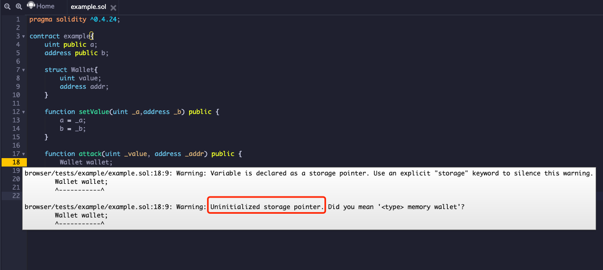
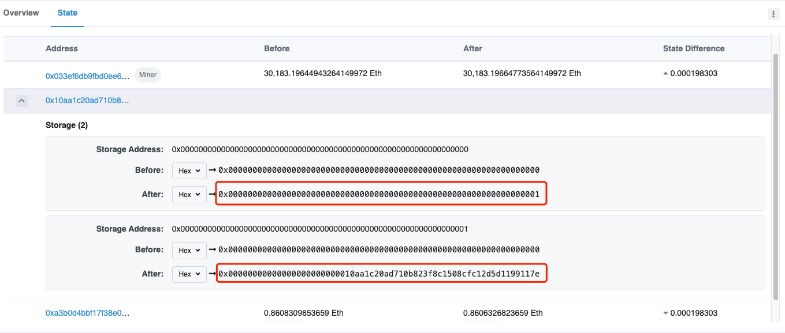
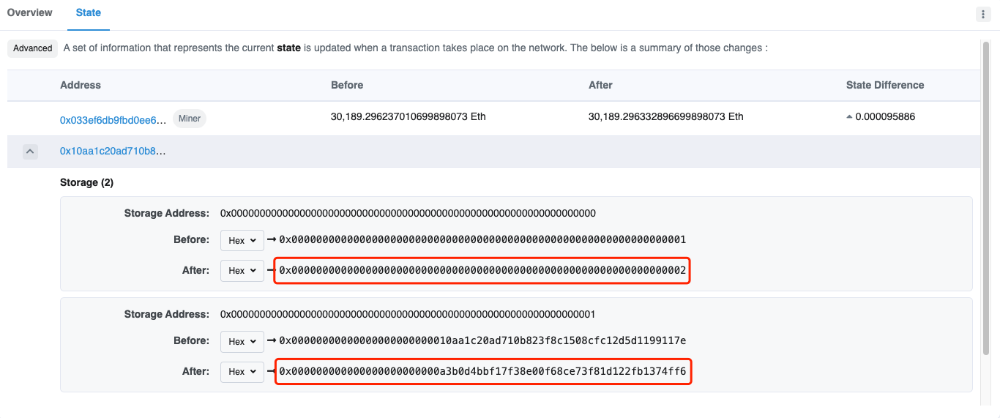
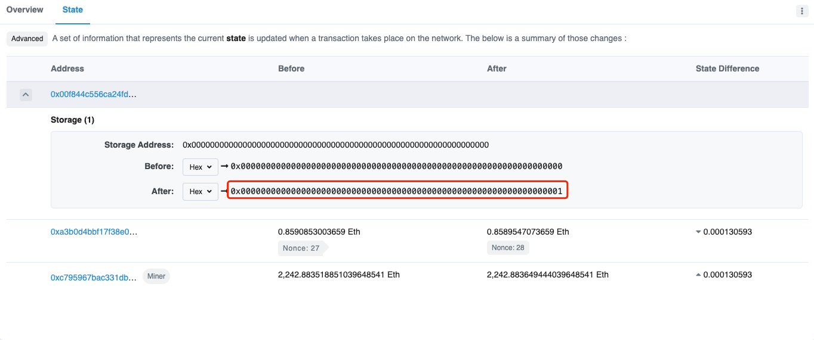
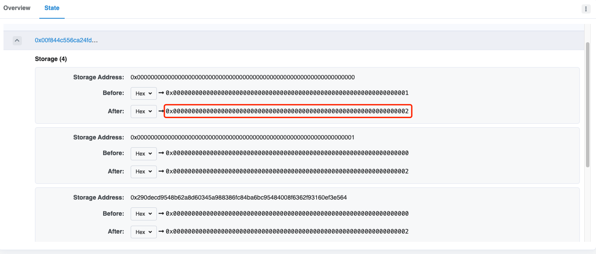

# Uninitialized Storage Pointer

## 原理
未初始化的存储指针是指在 EVM 中未进行初始化的 storage 变量，这个变量会指向其他变量的区域，从而更改其他变量的值。

## 例子
### 典型例子
我们来看下面这个例子：

```solidity
pragma solidity ^0.4.24;

contract example1{
    uint public a;
    address public b;

    struct Wallet{
        uint value;
        address addr;
    }

    function setValue(uint _a,address _b) public {
        a = _a;
        b = _b;
    }

    function attack(uint _value, address _addr) public {
        Wallet wallet;
        wallet.value = _value;
        wallet.addr = _addr;
    }
}
```

将这份代码放入 Remix 中，它会提示 Uninitialized Storage Pointer：



在我们部署后，首先使用 setValue 函数将 a 和 b 的值分别设为 1 和 0x10aA1C20aD710B823f8c1508cfC12D5d1199117E，可以从交易中发现设置成功：



然后我们调用 attack 函数，传入的 _value 和 _addr 值分别为 2 和 0xa3b0D4BBF17F38e00F68Ce73f81D122FB1374ff6，可以从交易中发现 a 和 b 被传入的 _value 和 _addr 值覆盖了：



这个例子的修复方案是使用 mapping 进行结构体的初始化，并使用 storage 进行拷贝：

```solidity
pragma solidity ^0.4.24;

contract example1{
    uint public a;
    address public b;

    struct Wallet{
        uint value;
        address addr;
    }

    mapping (uint => Wallet) wallets;

    function setValue(uint _a,address _b) public {
        a = _a;
        b = _b;
    }

    function fix(uint _id, uint _value, address _addr) public {
        Wallet storage wallet = wallets[_id];
        wallet.value = _value;
        wallet.addr = _addr;
    }
}
```

不仅仅是 struct 会遇到这个问题，数组也有同样的问题。我们来看下面的另一个例子：

```solidity
pragma solidity ^0.4.24;

contract example2{
    uint public a;
    uint[] b;

    function setValue(uint _a) public {
        a = _a;
    }

    function attack(uint _value) public {
        uint[] tmp;
        tmp.push(_value);
        b = tmp;
    }
}
```

将这份代码放入 Remix 中，它也会提示 Uninitialized Storage Pointer：


在我们部署后，首先使用 setValue 函数将 a 的值设为 1，可以从交易中发现设置成功：



然后我们调用 attack 函数，传入的 _value 值为 2，可以从交易中发现 a 被传入的 _value值覆盖了：



这个例子的修复方案是在声明局部变量 tmp 的时候对它进行初始化操作：

```solidity
pragma solidity ^0.4.24;

contract example2{
    uint public a;
    uint[] b;

    function setValue(uint _a) public {
        a = _a;
    }

    function fix(uint _value) public {
        uint[] tmp = b;
        tmp.push(_value);
    }
}
```

### 2019 BalsnCTF Bank
以 2019 Balsn CTF 的 Bank 的 WP 作为参考，讲解一下未初始化的存储指针的攻击方式。题目合约的源码如下：
```solidity
pragma solidity ^0.4.24;

contract Bank {
    event SendEther(address addr);
    event SendFlag(address addr);
    
    address public owner;
    uint randomNumber = 0;
    
    constructor() public {
        owner = msg.sender;
    }
    
    struct SafeBox {
        bool done;
        function(uint, bytes12) internal callback;
        bytes12 hash;
        uint value;
    }
    SafeBox[] safeboxes;
    
    struct FailedAttempt {
        uint idx;
        uint time;
        bytes12 triedPass;
        address origin;
    }
    mapping(address => FailedAttempt[]) failedLogs;
    
    modifier onlyPass(uint idx, bytes12 pass) {
        if (bytes12(sha3(pass)) != safeboxes[idx].hash) {
            FailedAttempt info;
            info.idx = idx;
            info.time = now;
            info.triedPass = pass;
            info.origin = tx.origin;
            failedLogs[msg.sender].push(info);
        }
        else {
            _;
        }
    }
    
    function deposit(bytes12 hash) payable public returns(uint) {
        SafeBox box;
        box.done = false;
        box.hash = hash;
        box.value = msg.value;
        if (msg.sender == owner) {
            box.callback = sendFlag;
        }
        else {
            require(msg.value >= 1 ether);
            box.value -= 0.01 ether;
            box.callback = sendEther;
        }
        safeboxes.push(box);
        return safeboxes.length-1;
    }
    
    function withdraw(uint idx, bytes12 pass) public payable {
        SafeBox box = safeboxes[idx];
        require(!box.done);
        box.callback(idx, pass);
        box.done = true;
    }
    
    function sendEther(uint idx, bytes12 pass) internal onlyPass(idx, pass) {
        msg.sender.transfer(safeboxes[idx].value);
        emit SendEther(msg.sender);
    }
    
    function sendFlag(uint idx, bytes12 pass) internal onlyPass(idx, pass) {
        require(msg.value >= 100000000 ether);
        emit SendFlag(msg.sender);
        selfdestruct(owner);
    }

}
```

我们的目标是要执行 emit SendFlag(msg.sender)，很明显不能通过 sendFlag 函数来触发，因为我们肯定不能满足 msg.value >= 100000000 ether。

如果我们仔细观察代码，会发现有两处未初始化的存储指针：

```solidity
modifier onlyPass(uint idx, bytes12 pass) {
[...]
    FailedAttempt info; <--
[...]
}

function deposit(bytes12 hash) payable public returns(uint) {
[...]
    SafeBox box; <--
[...]
}
```

那么我们需要思考如何利用它们。我们首先来看看合约刚创建的时候的 slot 的布局：

```
-----------------------------------------------------
|     unused (12)     |          owner (20)         | <- slot 0
-----------------------------------------------------
|                 randomNumber (32)                 | <- slot 1
-----------------------------------------------------
|               safeboxes.length (32)               | <- slot 2
-----------------------------------------------------
|       occupied by failedLogs but unused (32)      | <- slot 3
-----------------------------------------------------
```

onlyPass 中的 FailedAttempt 的布局如下，它会覆盖原先的 slot0 到 slot2 的内容：

```
-----------------------------------------------------
|                      idx (32)                     |
-----------------------------------------------------
|                     time (32)                     |
-----------------------------------------------------
|          tx.origin (20)      |   triedPass (12)   |
-----------------------------------------------------
```

deposit 中的 SafeBox 的布局如下，它会覆盖原先的 slot0 到 slot1 的内容：

```
-----------------------------------------------------
| unused (11) | hash (12) | callback (8) | done (1) |
-----------------------------------------------------
|                     value (32)                    |
-----------------------------------------------------
```

如果当 FailedAttempt 中的 tx.origin 足够大的时候，就可以覆盖 safeboxes.length 并把它也改成一个足够大的值，这样在调用 withdraw 函数的时候就可以将访问到 failedLogs，我们便可以控制 callback 为任意的内容并控制程序执行流。

那么我们需要控制执行流到什么地方呢？在 opcodes 那节介绍过，跳转指令只能跳转到 JUMPDEST 处，我们需要控制程序执行流跳转到 emit SendFlag(msg.sender) 前的地方，也就是下面所示的 070F 处：

```
06F6 6A PUSH11 0x52b7d2dcc80cd2e4000000
0702 34 CALLVALUE
0703 10 LT
0704 15 ISZERO
0705 15 ISZERO
0706 15 ISZERO
0707 61 PUSH2 0x070f
070A 57 JUMPI
070B 60 PUSH1 0x00
070D 80 DUP1
070E FD REVERT
070F 5B JUMPDEST <---- here
0710 7F PUSH32 0x2d3bd82a572c860ef85a36e8d4873a9deed3f76b9fddbf13fbe4fe8a97c4a579
0731 33 CALLER
0732 60 PUSH1 0x40
0734 51 MLOAD
0735 80 DUP1
0736 82 DUP3
```


最后我们来描述一下攻击的具体步骤：

- 寻找一个 address 开头较大的账户，之后的操作都用该账户进行。
- 由于 failedLogs 是 mapping 加上数组的形式，所以计算 target = keccak256(keccak256(msg.sender||3)) + 2 的值，也就是 failedLogs[msg.sender][0] 中的 tx.origin | triedPass 的 slot 位置。
- 计算 safeboxes 数组中第一个元素所在的 slot 的位置，也就是 base = keccak256(2)。
- 计算 target 在 safeboxes 数组中的索引，由于 safeboxes 数组中一个元素会占据两个 slot，所以计算出来为 idx = (target - base) // 2。
- 判断 (target - base) % 2 是否为 0，如果是则 tx.origin | triedPass 刚好可以覆盖到 unused | hash | callback | done，进而可以控制到 callback；否则返回第一步。
- 判断 (msg.sender << (12 * 8)) 是否大于 idx，如果是则 safeboxes 可以访问到 target 处；否则返回第一步。
- 调用 deposit 函数，设置传入的 hash 值为 0x000000000000000000000000 并附带 1 ether，这样我们便可以设置 safeboxes[0].callback = sendEther。
- 调用 withdraw 函数，设置传入的 idx 值为 0，pass 值为 0x111111111111110000070f00，由于上一步我们设置了 safeboxes[0].callback = sendEther，那么这一步便会调用 sendEther 函数，进而走到 onlyPass 中的 if 分支中，使得 failedLogs[msg.sender][0] 中的 triedPass 被修改为了我们传入的 pass 值，同时这步操作也修改了 safeboxes.length 为 msg.sender | pass。
- 调用 withdraw 函数，设置传入的 idx 值为我们在第四步中所计算出的 idx 值，pass 值为 0x000000000000000000000000，那么程序执行流便会跳转到 emit SendFlag(msg.sender) 继续执行，最终目标合约会自毁，攻击成功。

!!! note
    注：攻击步骤中的 slot 计算规则可以在 Ethereum Storage 节中查看。


## 题目

### Balsn 2019
- 题目名称 Bank

### RCTF 2020
- 题目名称 roiscoin

### Byte 2019
- 题目名称 hf

### 数字经济大赛 2019
- 题目名称 cow
- 题目名称 rise

!!! note
    注：题目附件相关内容可至 [ctf-challenges/blockchain](https://github.com/ctf-wiki/ctf-challenges/tree/master/blockchain) 仓库寻找。

## 参考

- [以太坊 Solidity 未初始化存储指针安全风险浅析](https://github.com/slowmist/papers/blob/master/Solidity_Unintialised_Storage_Pointers_Security_Risk.pdf)
- [Balsn CTF 2019 - Bank](https://x9453.github.io/2020/01/16/Balsn-CTF-2019-Bank/)